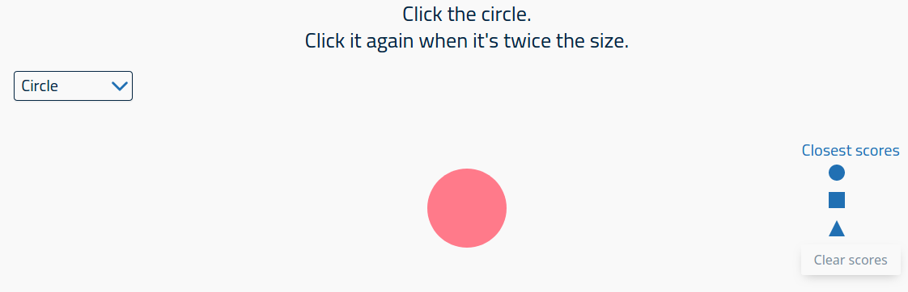

# Click the Shape
> A game where you aim to click the shape when it's twice the size

## Table of contents
* [General info](#general-info)
* [Screenshots](#screenshots)
* [Technologies](#technologies)
* [Learnings](#learnings)
* [Setup](#setup)
* [Features](#features)
* [Status](#status)
* [Inspiration](#inspiration)
* [Contact](#contact)

## General info
The original was Click the Dot, where you clicked on a circle when it was twice the size. This version also includes a triangle and a square.

## Screenshots

## Technologies
* HTML
* SCSS
* jQuery
* Gulp 4

## Learnings
* Local Storage
* SVG in HTML
* SVG animation in jQuery

## Setup
To view this project visit the [demo](https://click-the-shape.netlify.com/) or download the files and open index.html

## Features
* Scoring
* High score

## Status
Project is: _finished_

## Inspiration
Confetti is copied from https://www.codeseek.co/moonglows76/css-confetti-BRVrgZ

## Contact
Created by [nicm42](https://www.twitter.com/nicm4242) - feel free to contact me!
